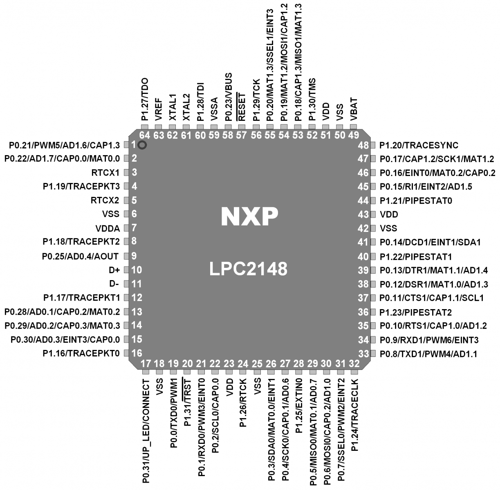

# Smart Lighting System on ARM7 LPC2148 (Ultrasonic Presence Detection)

This repository contains a complete, GitHub-ready version of the **Smart Lighting System** built on an **ARM7 LPC2148** microcontroller. It turns a light (LED) and buzzer **ON** when a person is detected within a threshold distance, and **OFF** otherwise—using an **HC-SR04 ultrasonic sensor**.

---

## Repository Structure

```
lpc2148-arm7-smart-lighting/
├─ src/                 # Embedded C source code
├─ inc/                 
├─ projects/
│  ├─ keil/             
│  └─ gcc/              
├─ docs/
│  ├─ assets/           
│  └─ Project_Report.pdf
├─ .github/workflows/   
├─ .gitignore
├─ LICENSE (MIT)
└─ README.md
```

Included images:
- `docs/assets/lpc2148_illustration.png` – an illustrative image of an **ARM7 LPC2148** microcontroller on a dev board (for README usage).
- docs/assets/pdfimg_p0_i0.png
- docs/assets/pdfimg_p1_i0.png
- docs/assets/pdfimg_p4_i0.png
- docs/assets/pdfimg_p9_i0.png

---

## Hardware Overview

- **MCU**: NXP **LPC2148** (ARM7TDMI-S core, 32-bit)
- **Sensor**: **HC-SR04** Ultrasonic sensor  
  - **TRIG** → `P0.2` (output)  
  - **ECHO** → `P0.3` (input)
- **Outputs**:  
  - **LED(s)** → `P0.16..P0.23` (output mask `0xFF << 16`)  
  - **Buzzer** → `P0.9` (output)
- **Power**: Board 3.3V, sensor uses 5V (use level shifting or tolerances as per your board; many dev boards provide a safe echo signal).

<p align="center">
  
</p>

---

## How It Works

1. **Initialization**  
   - All needed GPIO pins are configured:
     - `P0.2` → TRIG (output)
     - `P0.3` → ECHO (input)
     - `P0.16..P0.23` → LEDs (output mask)
     - `P0.9` → Buzzer (output)

2. **Ultrasonic Ranging**  
   - The MCU generates a **10µs** pulse on **TRIG**.  
   - The sensor emits ultrasound; the echo time on **ECHO** corresponds to distance.

3. **Distance Calculation**  
   - Distance (approx) = `t * 0.0343 / 2` (cm), where `t` is in microseconds.

4. **Decision Logic**  
   - If `distance < 15 cm` → **LED ON, Buzzer ON**  
   - Else → **LED OFF, Buzzer OFF**

5. **Loop**  
   - Repeats every ~300 ms for continuous monitoring.

---

## Source Code

See [`src/main.c`](src/main.c). This is directly adapted from your report and cleaned into a buildable file.

Key snippets:
```c
IO0DIR |= (1<<2);       // TRIG: P0.2 output
IO0DIR &= ~(1<<3);      // ECHO: P0.3 input
IO0DIR |= (0xFF<<16);   // LEDs: P0.16..P0.23 output
IO0DIR |= (1<<9);       // Buzzer: P0.9 output
```

---

## Building & Flashing

### Option A: Keil µVision (recommended if that's what you used)
1. Create a new LPC2148 project in Keil µVision.
2. Add `src/main.c` to the target.
3. Configure clock (12 MHz typical) and startup files as per your board.
4. Build and program via your chosen adapter (J-Link, ULINK, etc.).
5. If using **Flash Magic** over UART/ISP:
   - Boot into ISP (P0.14 low at reset on many boards).
   - Select correct COM port and device (LPC2148).
   - Program the generated hex file.

### Option B: GCC (arm-none-eabi)
1. Install the toolchain: `arm-none-eabi-gcc` and friends.
2. Navigate to `projects/gcc` and run:
   ```bash
   make
   ```
3. This produces `smart_lighting.bin`. You can adapt a linker script/startup as needed for a full bare‑metal setup.

> **Note:** The provided Makefile is minimal and meant as a starting point. For a production bare‑metal GCC build you will want proper startup code, linker script, and vendor headers.

---

## Pin Notes / Troubleshooting

- If your LEDs are **active low**, clearing the bit turns them **ON** (as done here).
- Ensure **ECHO** is 3.3V tolerant or level-shifted (some modules provide safe output).  
- If distance readings are inconsistent:
  - Add a microsecond timer/capture instead of delay loops for precise timing.
  - Average multiple measurements.
  - Debounce the decision threshold with hysteresis (e.g., ON < 15 cm; OFF > 18 cm).

---

## Credits & Authors

- **Niranjan Patil (2GI22EC083)**  
- **Nishanth S (2GI22EC084)**  
- **Om Ganada (2GI22EC085)**  

Converted to a structured GitHub repo by an assistant tool, preserving the original intent and content.

---

## License

This project is licensed under the **MIT License**. See [`LICENSE`](LICENSE) for details.
